# HU-6: Eliminar Bootcamp — Diagramas de Flujo

## Contexto

La eliminación es **distribuida** (datos en 3 bases de datos, comunicadas por HTTP):

- `api-bootcamp` → tabla `bootcamp`
- `api-capability` → tablas `capability`, `bootcamp_capability`
- `api-technology` → tablas `technology`, `capability_technology`

R2DBC soporta transacciones locales por servicio, pero **NO transacciones distribuidas** entre microservicios.

---

## Alternativa A: SAGA Orquestada con Compensación

El `api-bootcamp` orquesta todo. Si un paso falla, ejecuta compensaciones en orden inverso.

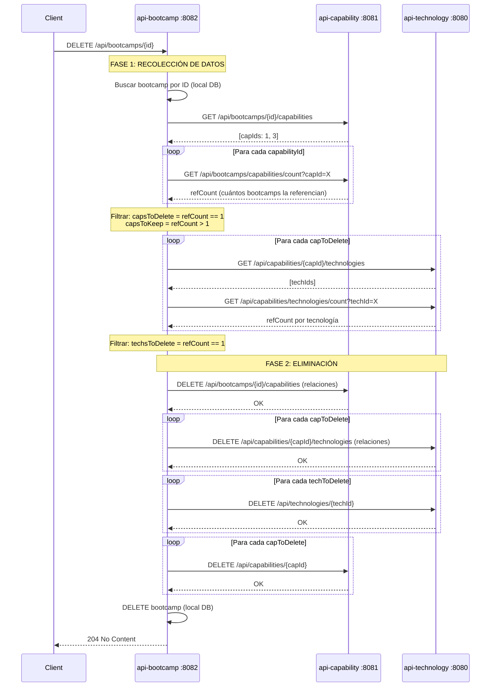

### Flujo de Compensación (si falla en Fase 2)

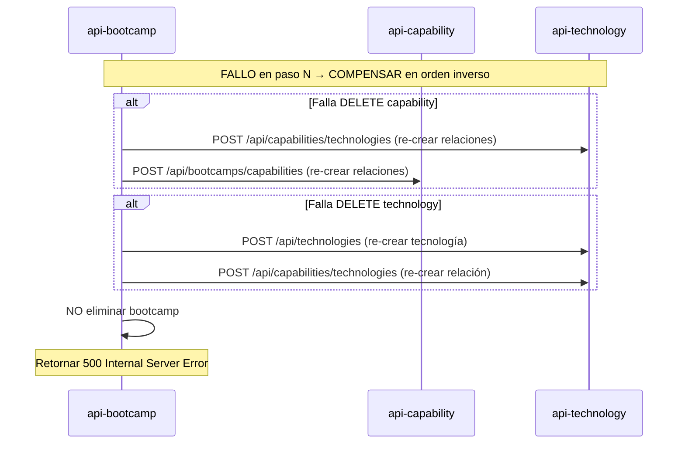

### Pros y Contras

| Pros | Contras |
|------|---------|
| Control total del orquestador | Muchas llamadas HTTP (latencia) |
| Fácil de entender | Compensaciones pueden fallar (doble fallo) |
| Compatible con WebClient reactivo | No es atómico en sentido estricto |

---

## Alternativa B: Two-Phase (Soft Delete + Confirmación)

Se marca todo como "pendiente de eliminación" y luego se confirma. Si falla, se revierte la marca.

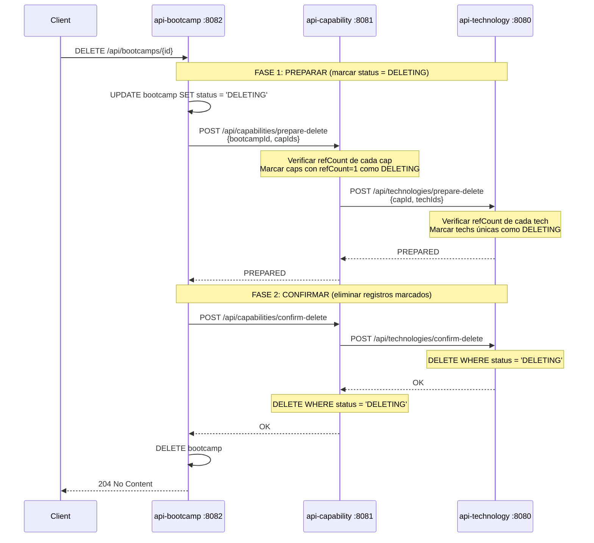

### Flujo de Rollback

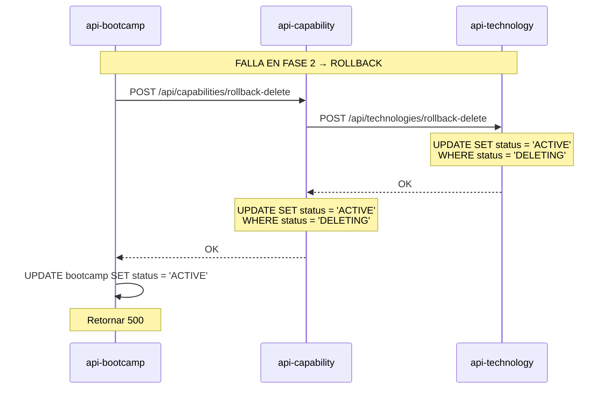

### Pros y Contras

| Pros | Contras |
|------|---------|
| Más seguro: datos no se pierden hasta confirmación | Requiere agregar columna `status` a todas las tablas |
| Job de limpieza puede resolver estados huérfanos | Mayor complejidad (3 fases) |
| Recuperable ante caídas del proceso | Necesita scheduled job para DELETING huérfanos |

---

## Alternativa C: Orden Bottom-Up (Best Effort) ⭐ RECOMENDADA

Cada microservicio es responsable de eliminar sus datos huérfanos. El orden bottom-up garantiza que si falla un nivel inferior, el superior no se elimina.

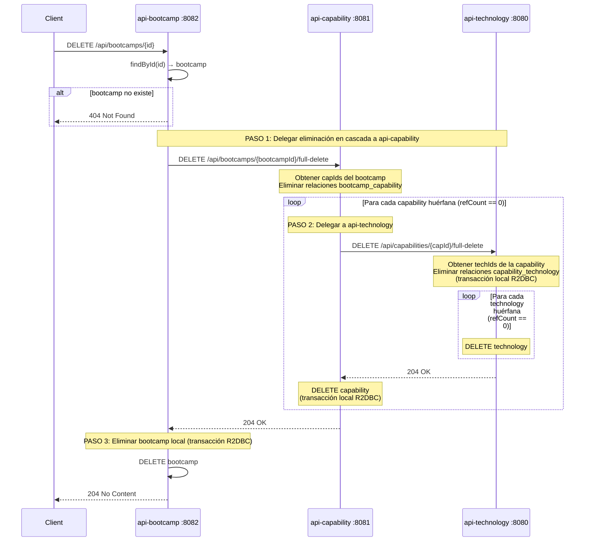

### Detalle: Lógica interna de cada servicio

```mermaid
flowchart TD
    subgraph "api-bootcamp (orquestador)"
        A[DELETE /api/bootcamps/id] --> B{¿Existe bootcamp?}
        B -->|No| C[404 Not Found]
        B -->|Sí| D[Llamar api-capability:<br/>DELETE /bootcamps/id/full-delete]
        D --> E{¿Respuesta OK?}
        E -->|Error| F[500 - No eliminar bootcamp<br/>Propagar error]
        E -->|OK| G[DELETE bootcamp local<br/>Transacción R2DBC]
        G --> H[204 No Content]
    end

    subgraph "api-capability"
        I[DELETE /bootcamps/bootcampId/full-delete] --> J[Obtener capIds del bootcamp]
        J --> K[DELETE bootcamp_capability<br/>WHERE bootcampId = X]
        K --> L{Para cada cap:<br/>¿refCount en bootcamp_capability == 0?}
        L -->|Sí: huérfana| M[Llamar api-technology:<br/>DELETE /capabilities/capId/full-delete]
        M --> N{¿OK?}
        N -->|OK| O[DELETE capability]
        N -->|Error| P[onErrorResume: propagar error]
        L -->|No: referenciada| Q[No eliminar cap]
        O --> R[Continuar con siguiente cap]
        Q --> R
    end

    subgraph "api-technology"
        S[DELETE /capabilities/capId/full-delete] --> T[Obtener techIds de la capability]
        T --> U[DELETE capability_technology<br/>WHERE capabilityId = X]
        U --> V{Para cada tech:<br/>¿refCount en capability_technology == 0?}
        V -->|Sí: huérfana| W[DELETE technology]
        V -->|No: referenciada| X[No eliminar tech]
        W --> Y[Continuar]
        X --> Y
    end
```

### Manejo de Errores

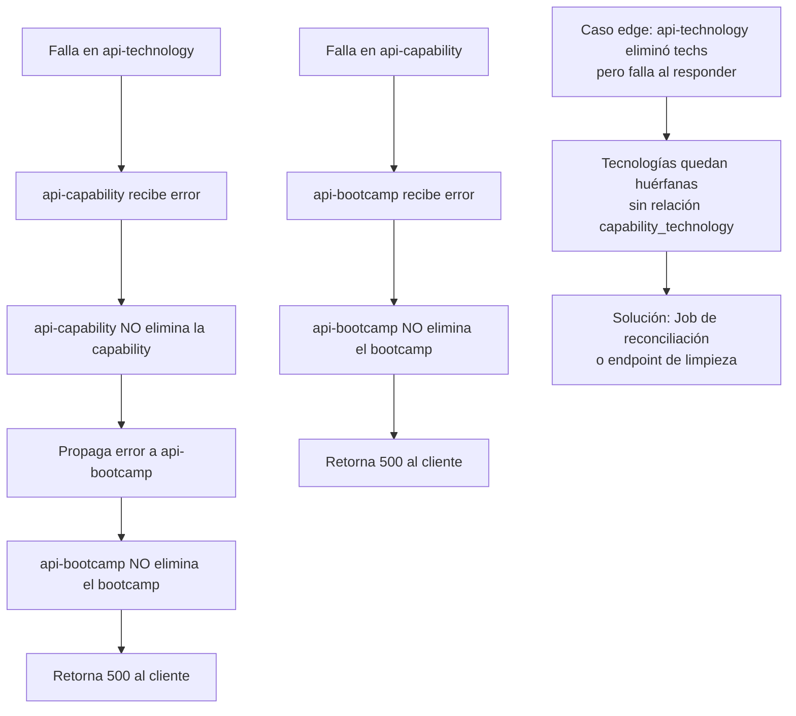

### Pros y Contras

| Pros | Contras |
|------|---------|
| Simple, sigue el patrón actual del proyecto | Caso edge: techs huérfanas si falla parcialmente |
| Orden bottom-up minimiza inconsistencias | No es 100% ACID distribuido |
| Cada servicio maneja transacción local R2DBC | — |
| Bootcamp solo se elimina si todo salió bien | — |
| Pocos endpoints nuevos | — |

---

## Alternativa D: Bottom-Up + Compensación ⭐ RECOMENDADA

Combina la simplicidad del flujo bottom-up (C) con rollback real mediante compensación. En el caso feliz es idéntico a C. La diferencia: si un paso falla después de que un servicio inferior ya hizo commit, se restaura lo eliminado.

### Flujo Principal

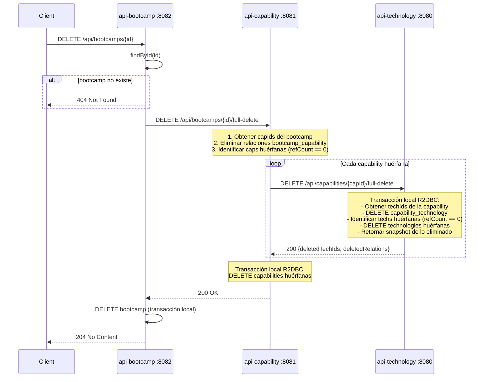

### Flujo de Compensación (fallo después de commit parcial)

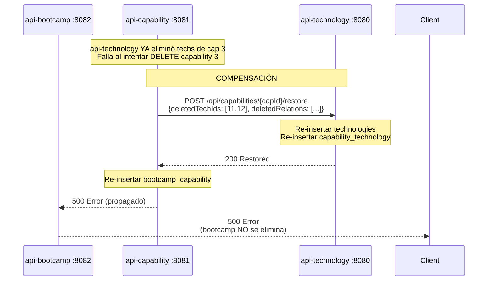

### Lógica Interna Detallada

```mermaid
flowchart TD
    subgraph "api-bootcamp"
        A[DELETE /api/bootcamps/id] --> B{¿Existe?}
        B -->|No| C[404]
        B -->|Sí| D[DELETE /bootcamps/id/full-delete<br/>en api-capability]
        D --> E{¿OK?}
        E -->|Error| F[500 - Bootcamp NO se elimina]
        E -->|OK| G[DELETE bootcamp local]
        G --> H[204 No Content]
    end

    subgraph "api-capability"
        I[DELETE /bootcamps/id/full-delete] --> J[Obtener capIds]
        J --> K[DELETE bootcamp_capability]
        K --> L[Identificar caps huérfanas<br/>refCount == 0]
        L --> M[Para cada huérfana:<br/>DELETE /capabilities/capId/full-delete<br/>en api-technology]
        M --> N[Guardar snapshot de cada respuesta]
        N --> O[DELETE capabilities huérfanas]
        O --> P{¿OK?}
        P -->|Sí| Q[200 OK]
        P -->|No| R[COMPENSAR:<br/>POST /restore a api-technology<br/>RE-INSERTAR bootcamp_capability]
        R --> S[Propagar 500]
    end

    subgraph "api-technology"
        T[DELETE /capabilities/capId/full-delete] --> U[Obtener techIds]
        U --> V[DELETE capability_technology]
        V --> W[Identificar techs huérfanas<br/>refCount == 0]
        W --> X[DELETE technologies huérfanas]
        X --> Y[Retornar snapshot:<br/>deletedTechIds + deletedRelations]
    end

    subgraph "api-technology (restore)"
        Z[POST /capabilities/capId/restore] --> AA[RE-INSERT technologies]
        AA --> AB[RE-INSERT capability_technology]
        AB --> AC[200 Restored]
    end
```

### Estructura del Snapshot (lo que retorna cada full-delete)

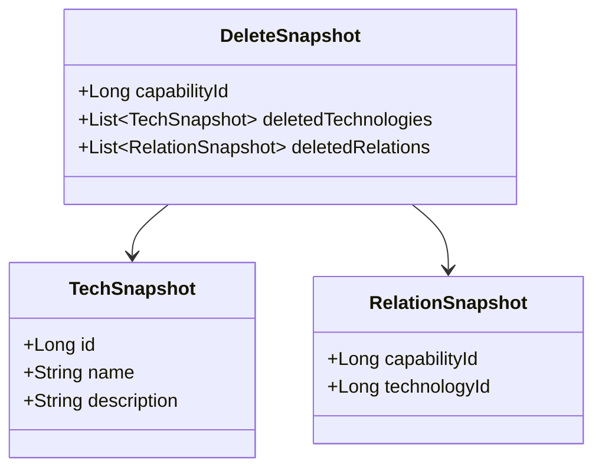

### Escenarios de Fallo y Comportamiento

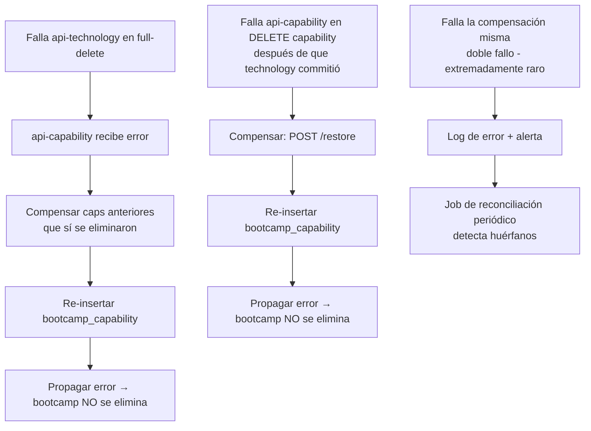

### Pros y Contras

| Pros | Contras |
|------|---------|
| Flujo feliz simple (bottom-up) | Complejidad media (snapshots + restore) |
| Rollback real ante fallos parciales | Doble fallo sigue siendo irrecuperable |
| No requiere cambios en schema | 2 endpoints extra (full-delete + restore) |
| Compatible con patrón actual del proyecto | — |
| Caso edge de techs huérfanas eliminado | — |
| Cada servicio maneja transacción local R2DBC | — |

---

## Comparación de Alternativas

| Criterio | A - SAGA | B - Two-Phase | C - Bottom-Up | D - Bottom-Up + Compensación ⭐ |
|----------|----------|---------------|---------------|----------------------------------|
| Complejidad | Media | Alta | Baja | Media |
| Consistencia | Alta | Muy alta | Alta (best effort) | Muy alta |
| Endpoints nuevos | ~8 | ~6 | 3 | 5 |
| Cambios en schema | No | Sí (columna status) | No | No |
| Latencia | Alta (muchas llamadas) | Media | Baja | Baja (caso feliz) |
| Rollback ante fallo parcial | Sí | Sí | No | Sí |
| Compatible con patrón actual | Sí | No | Sí | Sí |
| Caso edge huérfanos | Resuelto | Resuelto | Posible | Resuelto |

---

## Endpoints Nuevos Requeridos

| Servicio | Endpoint | Método | Propósito |
|----------|----------|--------|-----------|
| `api-bootcamp` | `/api/bootcamps/{id}` | DELETE | Orquesta eliminación |
| `api-capability` | `/api/bootcamps/{bootcampId}/full-delete` | DELETE | Elimina relaciones + caps huérfanas + compensa si falla |
| `api-capability` | `/api/bootcamps/{bootcampId}/capabilities/restore` | POST | Restaura relaciones bootcamp-capability |
| `api-technology` | `/api/capabilities/{capabilityId}/full-delete` | DELETE | Elimina relaciones + techs huérfanas, retorna snapshot |
| `api-technology` | `/api/capabilities/{capabilityId}/restore` | POST | Restaura tecnologías y relaciones desde snapshot |

---

## Recomendación Final

**Alternativa D (Bottom-Up + Compensación)** porque:

1. El caso feliz es tan simple como la C (delegación en cascada, bottom-up)
2. Agrega rollback real: si `api-technology` ya commitió y luego falla `api-capability`, se restaura todo
3. No requiere cambios en el schema de las tablas
4. Sigue el patrón del proyecto (el `save` ya usa `onErrorResume` para rollback)
5. El único caso irrecuperable es el doble fallo (falla la operación Y falla la compensación), estadísticamente despreciable
