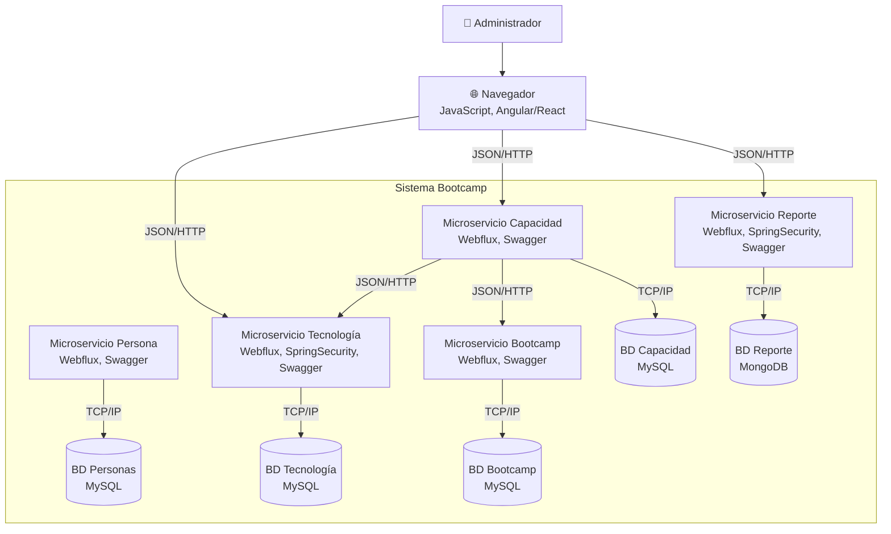
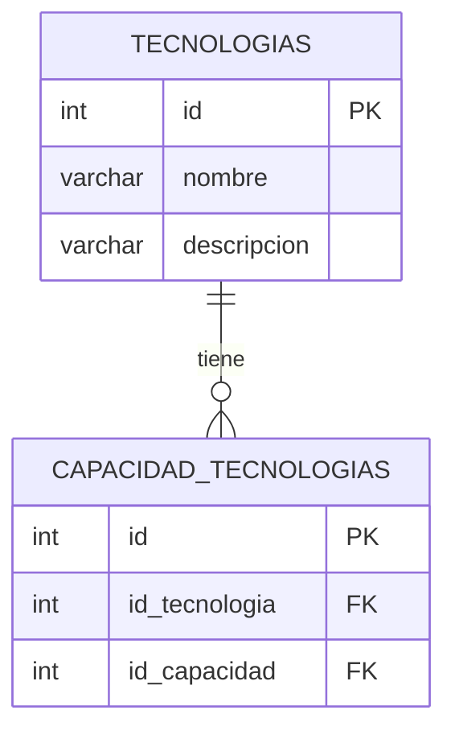
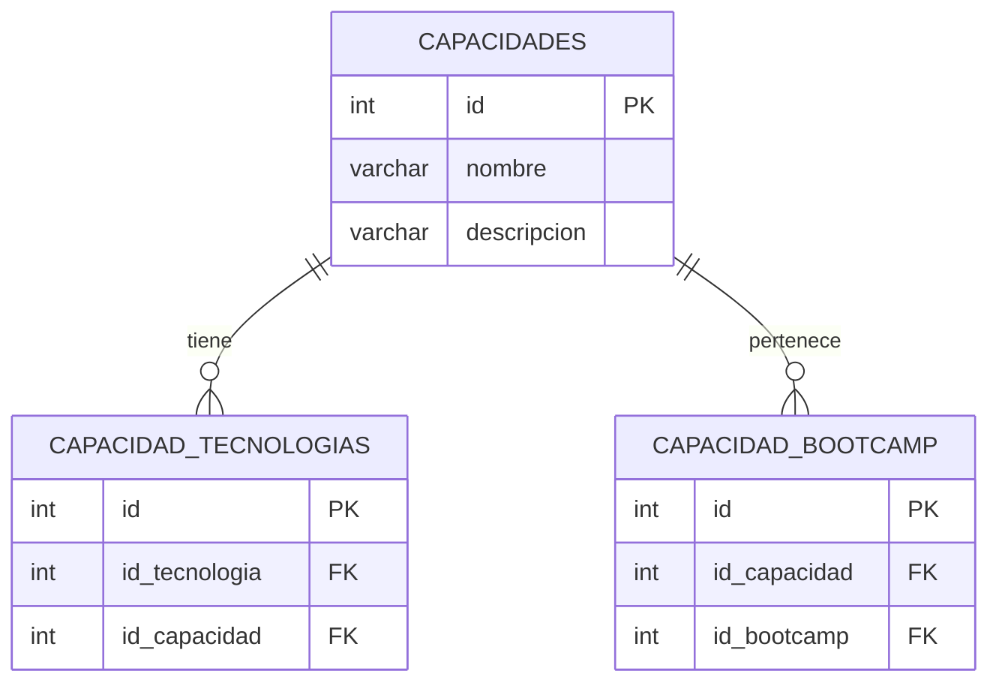
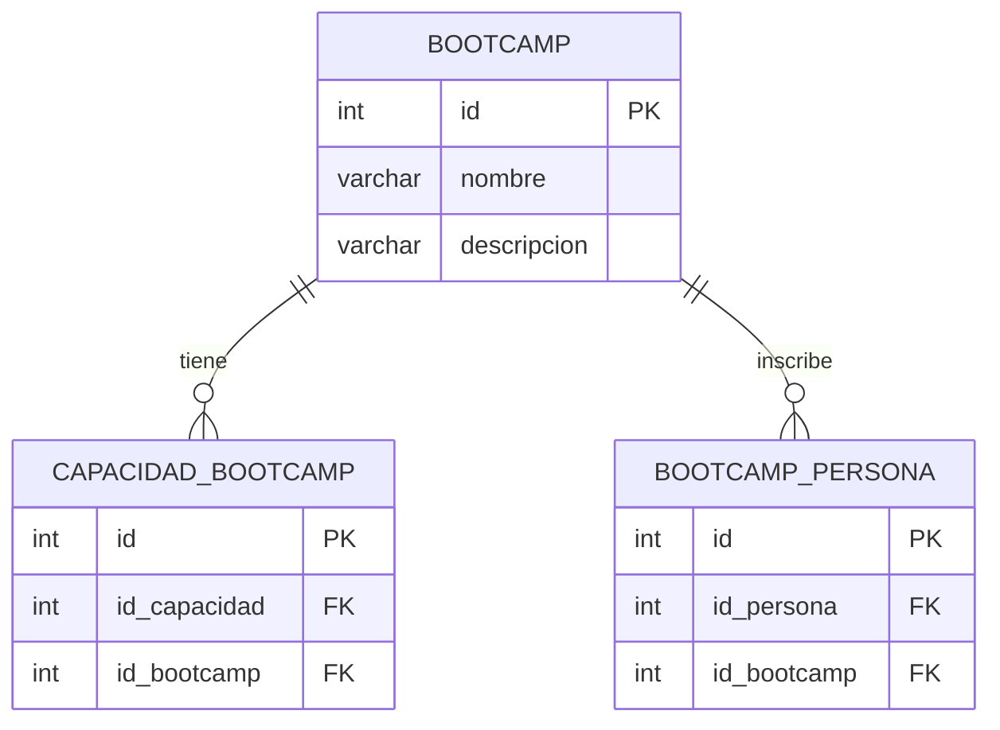
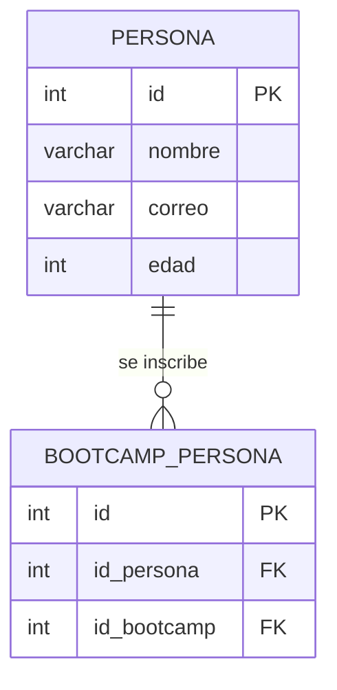
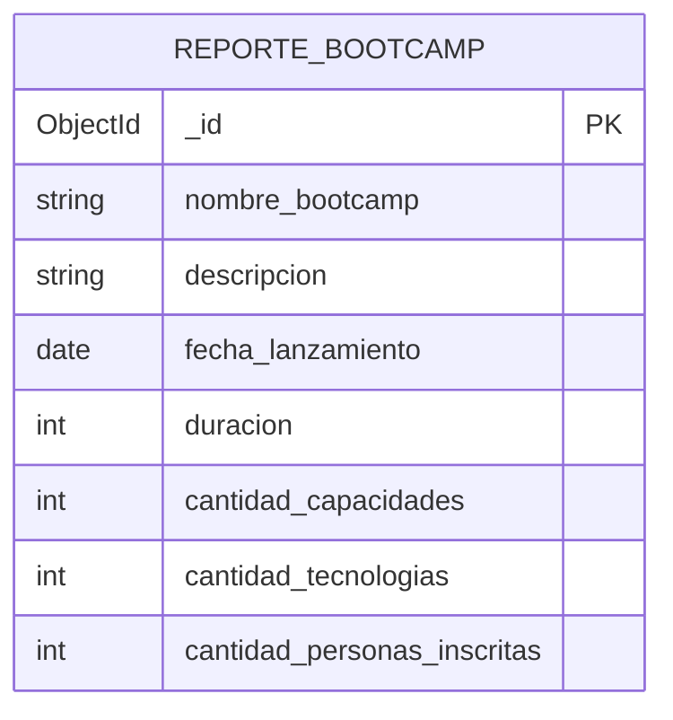
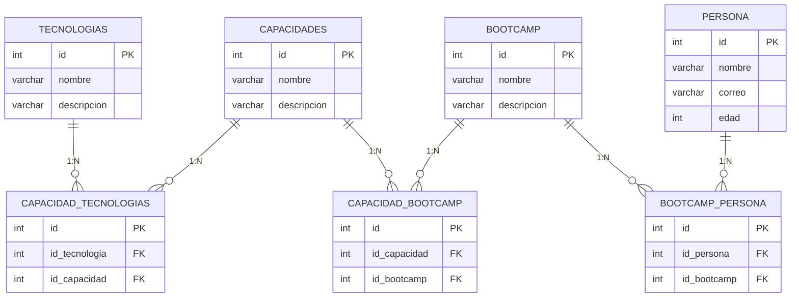

# Diagramas de Arquitectura

## Arquitectura de Microservicios (C4 - Contenedores)

---

## Base de Datos Relacional - Tecnología

## Base de Datos Relacional - Capacidad

## Base de Datos Relacional - Bootcamp

## Base de Datos Relacional - Persona

## Base de Datos No Relacional - Reporte (MongoDB)

> **Nota:** La estructura de la BD de reporte es una propuesta abierta. Cada implementación puede definir las colecciones según las métricas que necesite.

---

## Modelo Completo de Relaciones

